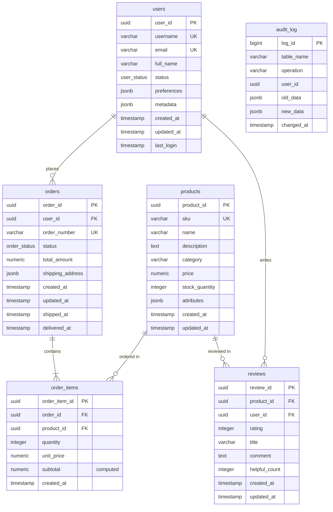
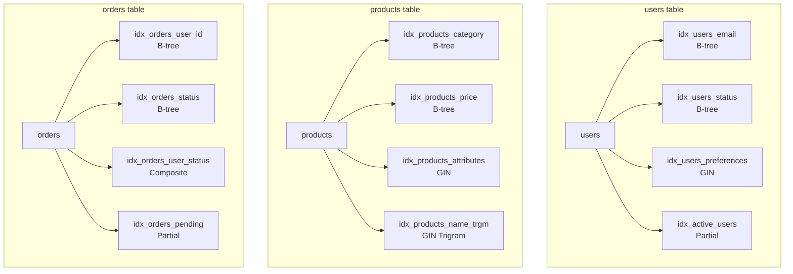
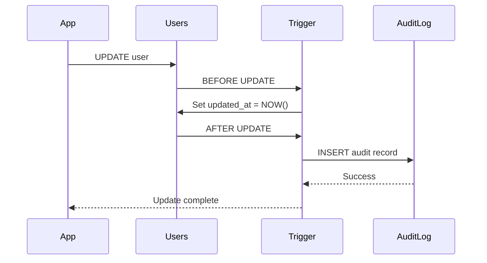
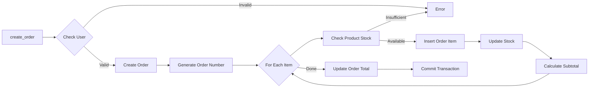
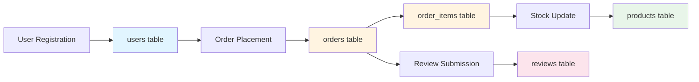

# Database Schema Diagram

## Entity Relationship Diagram

## Index Visualization

## Trigger Flow

## Order Creation Flow

## Data Flow

## Query Performance by Index Type

```mermaid
gantt
    title Query Performance Comparison (lower is better)
    dateFormat X
    axisFormat %s ms

    section Equality Search
    Without Index :0, 150
    B-tree Index :0, 5

    section Range Query
    Without Index :0, 200
    B-tree Index :0, 15

    section JSONB Query
    Without Index :0, 300
    GIN Index :0, 20

    section Full-Text Search
    LIKE Query :0, 250
    GIN Trigram :0, 30
```

## Table Relationships Summary

| Parent Table | Child Table | Relationship | Constraint |
|--------------|-------------|--------------|------------|
| users | orders | 1:N | ON DELETE CASCADE |
| users | reviews | 1:N | ON DELETE CASCADE |
| products | order_items | 1:N | ON DELETE RESTRICT |
| products | reviews | 1:N | ON DELETE CASCADE |
| orders | order_items | 1:N | ON DELETE CASCADE |

## Indexes Summary

| Table | Index Name | Type | Columns | Purpose |
|-------|-----------|------|---------|---------|
| users | idx_users_email | B-tree | email | Fast email lookup |
| users | idx_users_preferences | GIN | preferences | JSONB queries |
| users | idx_active_users | Partial B-tree | last_login WHERE status='active' | Active user queries |
| products | idx_products_price | B-tree | price | Price range queries |
| products | idx_products_attributes | GIN | attributes | JSONB attribute search |
| products | idx_products_name_trgm | GIN Trigram | name | Full-text search |
| orders | idx_orders_user_status | Composite B-tree | user_id, status | User order filtering |
| orders | idx_orders_pending | Partial B-tree | created_at WHERE status='pending' | Pending orders |

## Triggers Summary

| Trigger Name | Table | Event | Function | Purpose |
|--------------|-------|-------|----------|---------|
| update_users_updated_at | users | BEFORE UPDATE | update_updated_at_column() | Auto-update timestamp |
| audit_users | users | AFTER INSERT/UPDATE/DELETE | audit_trigger_function() | Audit logging |
| check_stock_before_order | order_items | BEFORE INSERT | check_product_stock() | Stock validation |
| order_status_timestamp | orders | BEFORE UPDATE | update_order_timestamps() | Status timestamp tracking |
